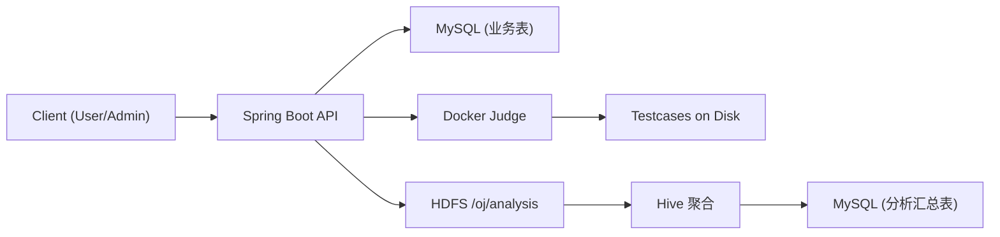

**Overview**
本系统是一个简易 OJ（Online Judge）平台，提供用户注册与登录、题目与测试用例管理、代码提交与 Docker 沙箱判题、判题结果查询，以及基于 Hadoop/Hive 的离线分析链路。

**Goals**
- 提供最小可用的 OJ 功能闭环，覆盖用户、题目、提交、判题、结果查询
- 判题使用 Docker 沙箱执行，具备资源限制与基础安全隔离
- 判题结果事件可导出到 HDFS，由 Hive 做离线聚合并回写 MySQL 供应用读取

**Roles**
- 管理员：管理题目、测试用例、分析导出与分析查询
- 普通用户：注册、登录、提交代码、查询自己的提交与结果

**Scope**
- 用户注册与登录（JWT）
- 题目管理（创建、查看）
- 测试用例管理（新增、覆盖、删除、列表）
- 提交与判题（异步队列、Docker 执行）
- 判题结果查询
- 分析事件导出到 HDFS
- Hive 离线聚合
- 分析结果回写 MySQL 并通过 API 查询

**Functional Requirements**
用户与认证：
- 支持用户注册与登录
- 使用 JWT 进行无状态认证
- 角色区分管理员与普通用户

题目与测试用例：
- 支持创建题目，包含标题、描述、时限、内存限制
- 支持测试用例路径式录入与内容式录入
- 支持测试用例列表、覆盖与删除

提交与判题：
- 支持 C/CPP/Java/Python 提交
- 提交触发判题任务入队，异步执行
- 判题输出包括 verdict、时间、内存、编译/运行错误信息
- 判题结果存档并支持查询

分析链路：
- 每次判题生成分析事件
- 事件批量导出到 HDFS（按 UTC 日期分区）
- Hive 统计每日汇总、题目维度汇总、用户维度汇总
- 聚合结果回写 MySQL
- 应用层提供分析查询 API

**Judge Specification**
支持语言：
- C
- CPP
- JAVA
- PYTHON

编译与运行命令：
```text
C:     gcc /workspace/Main.c -O2 -o /workspace/a.out
CPP:   g++ /workspace/Main.cpp -O2 -std=c++17 -o /workspace/a.out
JAVA:  javac /workspace/Main.java
PYTHON: (no compile)

C/CPP:   /workspace/a.out < {input} > {output}
JAVA:    java -cp /workspace Main < {input} > {output}
PYTHON:  python /workspace/main.py < {input} > {output}
```

输出对比规则：
- 统一换行符
- 忽略行尾空白
- 忽略末尾空行

资源限制与安全：
- Docker 沙箱运行，禁用网络
- 只读根文件系统，tmpfs 提供临时目录
- 限制 CPU、内存、进程数
- 判题超时为题目时限 + 1 秒
- 输出大小上限、代码大小上限

**Data & Storage**
- MySQL 存储业务表与分析汇总表
- 业务表（JPA 自动建表）：`users`、`problems`、`testcases`、`submissions`、`judge_tasks`、`judge_results`、`analysis_events`
- 分析汇总表（手动建表）：`analysis_summary_daily`、`analysis_problem_daily`、`analysis_user_daily`
- 测试用例文件存储在 `oj.judge.testcase-dir`
- 判题工作目录在 `oj.judge.work-dir`
- 分析事件导出到 HDFS：`oj.export.hdfs-dir`（默认 `/oj/analysis`）

**Security & Limits**
- JWT 认证，管理员由 `oj.security.admin-users` 配置
- 登录与提交限流（分钟级窗口）
- 判题容器禁网、降权、无特权、cap-drop ALL

**Reliability & Stability**
- 判题任务异步执行，支持并发控制
- 失败任务按重试策略延迟重试
- 判题完成后清理工作目录
- HDFS 导出失败会返回错误信息

**Non-Goals**
- 暂不支持竞赛模式、排行榜、题解、代码查重
- 暂不支持分布式判题调度与队列
- 暂不提供多租户与细粒度 RBAC

**Configuration**
判题配置键：
- `oj.judge.work-dir`
- `oj.judge.testcase-dir`
- `oj.judge.max-concurrency`
- `oj.judge.max-retries`
- `oj.judge.retry-delay-seconds`
- `oj.judge.cpus`
- `oj.judge.memory-mb`
- `oj.judge.pids-limit`
- `oj.judge.max-output-kb`
- `oj.judge.max-code-size-kb`
- `oj.judge.images.*`

分析配置键：
- `oj.export.hdfs-uri`
- `oj.export.hdfs-dir`
- `oj.export.batch-size`
- `oj.export.cron`
- `oj.export.hadoop-user`
- `oj.export.hadoop-conf-dir`

安全配置键：
- `oj.security.jwt-secret`
- `oj.security.jwt-expiration-minutes`
- `oj.security.admin-users`

限流配置键：
- `oj.limits.submit-per-minute`
- `oj.limits.login-per-minute`

**Architecture**

